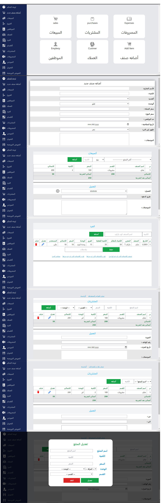

# Laravel POS

use Laravel version 10 and Tailwind this is `Design just`

## Install files laravel

```
compser install
```

## Install Tailwind

```
npm install -D tailwindcss postcss autoprefixer
npx tailwindcss init -p
```

Add the `@tailwind` directives for each of Tailwind’s layers to your` ./resources/css/app.`css file.

```
@tailwind base;
@tailwind components;
@tailwind utilities;
```

Make sure your compiled CSS is included in the `<head>` then start using Tailwind’s utility classes to style your content.


```
@vite('resources/css/app.css')
```

Look Tailwind Doc:

- [Tailwind](https://tailwindcss.com/docs/guides/laravel) - learn about Tailwind

## Getting Started

First, run the Project

```
php artisan serve
```

run in terminal

```
npm run dev
```

Open [http://127.0.0.1:8000](http://127.0.0.1:8000) with your browser to see the result.

## Image for project


